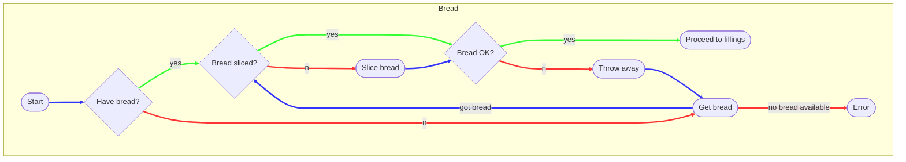
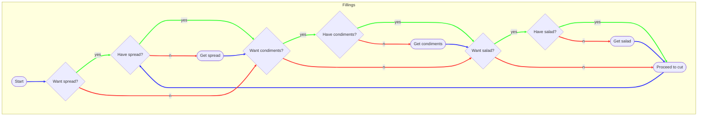
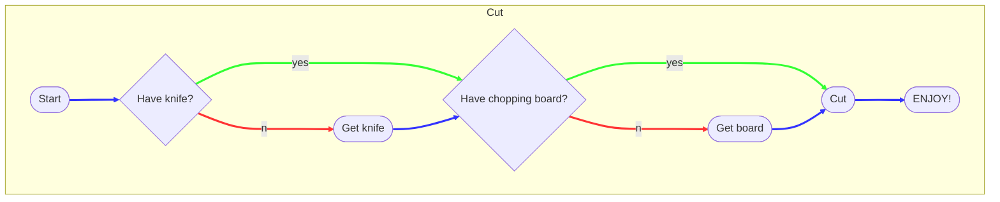

# Planning to Programming

## Portfolio Project 2

## Intro

Hi everyone, welcome to my webinar on planning to programming. This will be
focusing mainly around the portfolio two project, using JavaScript, CSS and
HTML. That saud, the approach is scaleable to any size project, section of a
project or even a single task.

First, just a very brief intro.

I'm Dave, I work behind the scenes at Code Institute and I am still a student on
the 5P course. I was fortunate enough to be studying full-time while learning
JavaScript so my projects have been fairly substantial. That said, I have been
developing my own approach to the projects as I have progressed and I would like
to share a few thoughts with you all.

I am very active on Slack because it helps me to learn. Viewing other people's
problems and seeing their approaches has opened my mind to other ways of
thinking. Remember, offering advice doesn't mean someone has to take it so get
active!

I had no previous programming knowledge before this course, however, I do come
from a background where I have had to plan my own work to ensure the highest
priorities are done in acceptable time frames. Back then, I was confident with
what I was doing and I had a very good estimation of the time involved with each
task. So how do we manage with something a little more vague? Well, hopefully I
am going to shed a little light on just one approach to getting your brilliant
ideas out into the world.

The content of this webinar will only be my take on things. It is not the only
way and it certainly isn't exhaustive, so if you have other ideas and tools and
tips, please share them in the Slack channels. The only competitions during your
time at CI are the hackathons (which you should all take part in) so if you find
something that will help your fellow students, I strongly urge you to share it.

## What's the big idea?

First, your project is going to start with an idea. A solution to a problem, be
it imaginary or not. That problem could be as simple as:

> I want to play a game  

It could be a more practical problem, something like a monthly budgeting
application that allows you to see how much money you have left each month for
the important things, like extra monitors!

If you don't have an idea yet, take a look through #peer-code-review; ask other
students; ask friends or family for problems they have that might be
transferable to a code solution; or use the suggested projects. Whatever you
decide, don't let yourself get too carried away with the scope. Push yourself to
make something that satisfies your criteria but don't let the scope scare you
away from starting.

Once you have an idea, write it down. Don't think about code. This will help you
find the key features that are necessary for your MVP. You can add some nice
extras, but make sure you note that they are extras and not requirements.

Writing your idea down will help keep the focus as you progress through the
project.

## Suggested Simple Questions

> What is my application going to do?
>
> Who is the application for?
>
> What are the essential features?
>
> Do I have the skills to code (most) of it?

## Research to Rational

So you have the start of a project now. The idea exists. Great. You have a clear
idea of what the application needs to do, who it is for and the essential
features required to make that happen. You also assessed the skills required and
decided you can do this. Then, if you are anything like most students at this
point, you lock up and panic. When you were conceptualising the application it
was simple: a variable here, a function there, a little funky styling and
presto, a super slick project with some awesome interactive functionality.

Now you actually have to write some code and you realise things are not as
straight forward as you may have anticipated. This is perfectly normal. It is
really important to experience this process too, once you come out the other
side you will realise how important planning and preparation can be.

Before you start to think about how you are going to create your awesome
project, why not spend some time and look at what else is out there. When
manufacturers started looking into electric vehicles, they didn't redesign the
entire car, just the part they needed to. Likewise, with your project, you don't
need to re-invent the wheel.

Find some nice examples of similar projects, or even just nice features within
applications, that could enhance the UX of your own project. Take the time to
look at the structure and approach to achieving the feature that you find
pleasing about it. If you find a feature that you really like but you haven't
been able to get your head around how it works, ask in Slack, use your resources
to your advantage. You may be the only person that will end up with a diploma
with your name on it, but accepting help from others along the way just makes
the journey easier - and more enjoyable!

## Ideas to Inception

Once you have your idea, how do you go about turning it into a project?

You have your idea, your world-changing application, but it is just a concept.
So how do you go about converting that idea into a reality. My personal
preference here is to think about what is involved in your application. Take the
time to write down the process from start to finish. Start vague and build up
each step in stages.

Let's think about an example. I like sandwiches, in fact after the PP3 modules
in the course, you could even say I *love* them. So if I want to write a program
that makes a sandwich, what would be involved?

Well, we have the starting point, no sandwich, and we have an end point, a
delicious sandwich, ready to eat. Sounds super simple, well that's a great start.

By reducing the complexity of our first steps we can clearly define our goals.
The:

> *What is my application going to do?*

| JavaScript || HTML / CSS |
|-|-|-|
| Make a sandwich || Display a tasty looking sandwich |

That isn't really much help to progressing on to coding anything yet though.
Let's delve in a little deeper. Break the process down into slightly more
detailed steps:

| JavaScript || HTML / CSS |
|-|-|-|
| <ol><li>Bread</li><li>Fillings</li><li>Cut</li><li>**Enjoy!**</li></ol> || <ol><li>Display a selection of breads that are selectable</li><li>Display a selection of fillings that are selectable</li><li>Provide UI to cut sandwich in half</li><li>**Enjoy!**</li></ol> |

These steps can be written as comments in your files. Remember, we still are not
thinking about code. Just sandwiches. I am also going to focus on the JavaScript
from here. Event listeners have been covered in a couple of other webinars and
that's generally how I would go about interfacing between what the user sees and
the JavaScript controlling it.

Now we can go down another level, let's focus on that first task:

1. Bread

If I ask you to make a sandwich in the middle of a swimming pool, chances are
you don't have a loaf of bread tucked up inside your swimming costume. I know
some might argue that you can make a sandwich without bread, but I am not
exploring that level of complexity. We can start to think about the steps
involved with using bread:

- Bread
  - Check if we have bread
    - If we do, continue
    - If we don't....get some bread
  - Is the bread sliced
    - If yes, great, continue
    - If not, slice the bread
  - Perhaps we should check the bread isn't mouldy or stale
    - If it is, throw it away
    - If it is OK, we move on to the next step

That seems complex enough for now, so move on to the second step:

2. Fillings

This one is a pretty open-ended task. We have a lot to consider here, but we
want to make things re-useable and not too specific just yet. Again, I am
working on the basis that the requirements of my sandwich are to always contain
at least one filling:

- Fillings
  - Do we want a spread, ie butter or margarine?
    - Yes - Do we have it?
      - If yes, continue
      - If no, get some
    - No - Continue
  - Choose filling(s)
    - Do we have the filling(s)?
      - If yes, continue
      - If no, get some
  - Do we want condiment(s)?
    - Yes - Do we have the condiment(s)?
      - If yes, continue
      - If no, get some
    - No - Continue
  - Do we want salad?
    - Yes - Do we have the salad?
      - If yes, continue
      - If no, get some
    - No - Continue

The more observant among you might notice we have a bit of repetition going on
now. That's OK for now but it is worth noting. We will tackle what to do with
that as we progress away from 'steps' and more into code. Others among you may
have noticed an error here, all I have done is _check_ the fillings. I have
separated the concerns within my 'fillings' step. So really, this step would be
better split into 'check fillings' and 'add fillings'.

- Fillings
  - Check fillings
    - Do we want a spread, ie butter or margarine?
      - Yes - Do we have it?
        - If yes, continue
        - If no, get some
      - No - continue
    - Choose filling(s)
      - Do we have the filling(s)?
        - If yes, continue
        - If no, get some
    - Do we want condiment(s)?
      - Yes - Do we have the condiment(s)?
        - If yes, continue
        - If no, get some
      - No - continue
    - Do we want salad?
      - Yes - Do we have the salad?
        - If yes, continue
        - If no, get some
      - No - continue
  - Add fillings
    - Are we adding a spread, ie butter or margarine?
      - Yes - apply it
      - No - continue
    - For each filling(s)
      - Add the filling
    - Are we adding condiment(s)?
      - Yes - add them
      - No - continue
    - Are we adding salad?
      - Yes - add it
      - No - continue

Next:

3. Cut

This is fairly straight forward:

- Cut
  - Do we have a knife?
    - If no, get a knife
    - If yes, continue
  - Do we have a chopping board?
    - If no, get a chopping board
    - If yes, continue
  - Cut in half

For those of you interested, the steps above are pretty much a bullet pointed
flow chart:  
[Mermaid Extension for VSCode/GitPod](https://marketplace.visualstudio.com/items?itemName=bierner.markdown-mermaid)

I threw in an error in case bread is not available. We won't be coding this
whole project, so I won't actually be doing any error handling there.

Finally, we have a sandwich...but we don't have any code, so how does this help?

Well, what we have now is some clearly defined smaller steps to help us work on
our code. These steps are clear and do not use code terminology, this is really
important. As you begin to code your project, it is very easy to convince
yourself that the code you have written is the correct, and only, way to do
something. Well...it isn't! By keeping your steps in plain language, when you
refer to them you may realise you are trying to shoehorn the wrong code into a
solution. Without those steps, you can go code blind; the process of diving so
far into one solution that you neglect to think about a simpler approach.

## Time to translate

